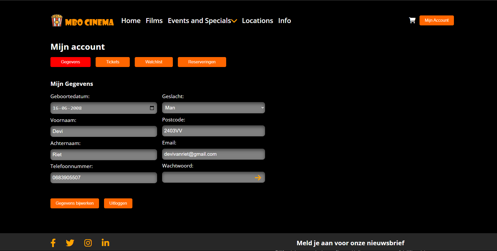

# MBOCinema  
Een complete bioscoopwebsite voor MBOCinema.  

## Wireframes  
[Bekijk de wireframes hier](https://www.figma.com/design/XghqG31kXu4kk3e8zPJWdu/MBOCinema?node-id=4-448&t=KkZGwwsESEQ4EIRx-0)  

## Installatie en Gebruik  

1. **Download een IDE**  
   PyCharm wordt aanbevolen dit kan ook in pycharm community.  

2. **Installeer Django**  
   Voer het volgende commando uit:  
   ```bash
   pip install django
   ```

3. **Installeer mysqlclient**  
   Voer het volgende commando uit:  
   ```bash
   pip install mysqlclient
   ```

4. **Clone de repository**  
   Voer het volgende commando uit:  
   ```bash
   git clone https://github.com/supersheeppro/MBOCinema.git
   ```
   
5. **Maak een database genaamd mbo_cinema**  
   Voer het volgende commando uit:  
    ```sql
   CREATE DATABASE mbo_cinema;
   ```
    
6. **Importeer `mbocinema.sql`(optioneel)**   
   Importeer mbocinema.sql in MySQL Workbench.  
   Let op: Als je deze stap uitvoert, kun je stap 8, 9 en 10 overslaan.
    
7. **Verwijder migratie bestanden**  
   Verwijder de content uit het volgende mapje:  
    ```bash
   Cinemaapp/migrations
   ```

8. **kijk in de `settings.py` of je de juiste parameters hebt**  
   Zorg ervoor dat je de juiste databaseparameters gebruikt:  
   ```python
   DATABASES = {
       'default': {
           'ENGINE': 'django.db.backends.mysql',
           'NAME': 'mbo_cinema',
           'USER': 'root',
           'PASSWORD': 'D@vi7596',
           'HOST': 'localhost',  # of een andere host als je database extern staat
           'PORT': '3306',  # of een andere poort als je MySQL op een andere poort draait
       },
   }
   ```
9. **Maak de migrations**  
    Voer het volgende commando uit:  
  ```bash
   python manage.py makemigrations
   ```

10. **Voer de migrations uit**  
   Voer het volgende commando uit:  
  ```bash
   python manage.py migrate
   ```

11. **Start de server**   
   Voer het volgende commando uit:   
   ```bash
   python manage.py runserver
   ```

## Sitemap
De sitemap vind je op http://127.0.0.1:8000/sitemap.xml

   ```xml
   <urlset xmlns="http://www.sitemaps.org/schemas/sitemap/0.9" xmlns:xhtml="http://www.w3.org/1999/xhtml">
   <script src="chrome-extension://mfidniedemcgceagapgdekdbmanojomk/js/elephant.js"/>
   <url>
   <loc>http://127.0.0.1:8000/</loc>
   <changefreq>daily</changefreq>
   <priority>0.8</priority>
   </url>
   <url>
   <loc>http://127.0.0.1:8000/search</loc>
   <changefreq>daily</changefreq>
   <priority>0.8</priority>
   </url>
   <url>
   <loc>http://127.0.0.1:8000/account/</loc>
   <changefreq>daily</changefreq>
   <priority>0.8</priority>
   </url>
   <url>
   <loc>http://127.0.0.1:8000/logout/</loc>
   <changefreq>daily</changefreq>
   <priority>0.8</priority>
   </url>
   <url>
   <loc>http://127.0.0.1:8000/login/</loc>
   <changefreq>daily</changefreq>
   <priority>0.8</priority>
   </url>
   <url>
   <loc>http://127.0.0.1:8000/winkelmand/</loc>
   <changefreq>daily</changefreq>
   <priority>0.8</priority>
   </url>
   <url>
   <loc>http://127.0.0.1:8000/checkout/</loc>
   <changefreq>daily</changefreq>
   <priority>0.8</priority>
   </url>
   <url>
   <loc>http://127.0.0.1:8000/info</loc>
   <changefreq>daily</changefreq>
   <priority>0.8</priority>
   </url>
   <url>
   <loc>http://127.0.0.1:8000/locations/</loc>
   <changefreq>daily</changefreq>
   <priority>0.8</priority>
   </url>
   <url>
   <loc>http://127.0.0.1:8000/verander-wachtwoord/</loc>
   <changefreq>daily</changefreq>
   <priority>0.8</priority>
   </url>
   <url>
   <loc>http://127.0.0.1:8000/reset-password/</loc>
   <changefreq>daily</changefreq>
   <priority>0.8</priority>
   </url>
   </urlset>
   ```   

## Use Case Diagram
   Use Case Narratives vind je in het project van deze repository


## UML Class Diagram(Text)

   ```sql
   +-----------------+        +-------------------+        +--------------------+
   |     Seat       |        |       Row         |        |       Zaal         |
   +-----------------+        +-------------------+        +--------------------+
   | row            | 1     * | zaal              | 1     * | title              |
   | seat_number    |        | row_number        |        | films              |
   | is_reserved    |        | is_vip            |        | events             |
   +-----------------+        +-------------------+        +--------------------+
           |                        | 1                      | 1
           |                        |                        |
           |                        |                        |
           v                        v                        v
   +----------------+       +--------------------+    +--------------------+
   |    Movie      |       |     Feature        |    |      Event         |
   +----------------+       +--------------------+    +--------------------+
   | title          | 1   * | name               | 1  *| title              |
   | description    |       |                    |     | description        |
   | release_date   |       +--------------------+     | date               |
   | duration       |                                  | rating             |
   | poster         |                                  | poster             |
   | rating         |                                  | location           |
   | genre          |                                  | movie (FK)         |
   | pegi_rating    |                                  | thumbnail          |
   | features       |                                  | zaal (FK)          |
   | zaal (FK)      |                                  | genre              |
   | video          |                                  | pegi_rating        |
   | locations      |                                  | price              |
   | price          |                                  +--------------------+
   +----------------+                                            |
            |                                                    |
            v                                                    v
   +---------------------+   +-------------------+   +--------------------+
   | StandardEventList   |   |   ShowTime        |   |      Ticket        |
   +---------------------+   +-------------------+   +--------------------+
   | title               | 1 * | movie (FK)        | 1  * | user (FK)         |
   | description         |     | start_time        |      | film (FK)         |
   | image               |     | end_time          |      | event (FK)        |
   | events              |     | date              |      | showtime (FK)     |
   +---------------------+     +-------------------+      | zaal (FK)         |
                                                          | row               |
                                                          | seat              |
                                                          | vip               |
                                                          | type              |
                                                          | price             |
                                                          +--------------------+
                                                               |
                                                               |
                                                               v
                                                     +------------------+
                                                     |  Reservation     |
                                                     +------------------+
                                                     | user (FK)        |
                                                     | film (FK)        |
                                                     | event (FK)       |
                                                     | showtime (FK)    |
                                                     | zaal (FK)        |
                                                     | reserved_on      |
                                                     | row              |
                                                     | seat             |
                                                     | vip              |
                                                     | type             |
                                                     | price            |
                                                     | status           |
                                                     | session_id       |
                                                     | guest_name       |
                                                     | guest_email      |
                                                     +------------------+
                                                               |
                                                               |
                                                               v
                                                      +-------------------+
                                                      | UserProfile       |
                                                      +-------------------+
                                                      | user (FK)         |
                                                      | birthday          |
                                                      | phone             |
                                                      | mail_subscribed   |
                                                      | gender            |
                                                      | postcode          |
                                                      +-------------------+
                                                               |
                                                               |
                                                               v
                                                      +-------------------+
                                                      | Watchlist         |
                                                      +-------------------+
                                                      | user (FK)         |
                                                      | movie (ManyToMany)|
                                                      | added_on          |
                                                      +-------------------+
                                                               |
                                                               |
                                                               v
                                                      +-------------------+
                                                      | Info              |
                                                      +-------------------+
                                                      | title             |
                                                      | info              |
                                                      | image             |
                                                      +-------------------+

   ```   


## Screenshots



